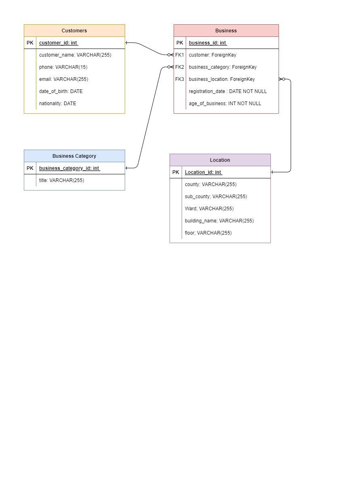

# Customer Business Management API

The Customer Business Management API is a Django project that will allow you to manage customer and business information efficiently.

## Features

- **Customer Management:** Add, update, and delete customer details including name, contact information, date of birth, and nationality.

- **Business Management:** Manage business information, including business name, registration date, and associated customer details.

- **Location Management:** Track business locations by specifying county, sub-county, ward, building name, and floor.

## Technologies Used

- Django: A high-level Python web framework for building web applications.

- Django Rest Framework: A powerful and flexible toolkit for building Web APIs.

## Setup Instructions

### Prerequisites

- Python 3.x
- pip

### Installation

1. Clone the repository:

   ```bash
   git clone https://github.com/your-username/customer-business-management.git

   ```

2. Navigate to the project directory:

   `cd customer-business-management`

3. Create a virtual environment (optional but recommended):

   `python -m venv venv`

4. Activate the virtual environment:

   - On Windows:

     `venv\Scripts\activate`

   - On macOS/Linux:

     `source venv/bin/activate`

5. Install dependencies:

   `pip install -r requirements.txt`

6. Apply database migrations:

   `python manage.py migrate`

7. Run the development server:

   `python manage.py runserver`

   The application will be accessible at http://127.0.0.1:8000/api/.

## API Endpoints

---

- Customer List: `http://127.0.0.1:8000/api/customers/` (GET, POST)
- Customer Detail: `http://127.0.0.1:8000/api/customer-detail/<int:pk>/` (GET, PUT, DELETE)
- Business List: `http://127.0.0.1:8000/api/businesses/` (GET, POST)
- Business Detail: `http://127.0.0.1:8000/api/business-detail/<int:pk>/` (GET, PUT, DELETE)

**Admin Panel**
You can use the admin panel to access and manipulate the APIs data as well
http://127.0.0.1:8000/admin
username: josh
password: adminadminuser

## Run Tests

    `python manage.py test`

## **Usage**

1.  Access the provided API endpoints using tools like `curl`, `httpie`, or your preferred API testing tool.
2.  Use the provided Django Rest Framework frontend by visiting http://localhost:8000/ in your web browser.
3.  Integrate the API into your own frontend application by making HTTP requests to the defined endpoints.

## Database Design Diagram


